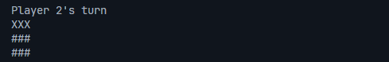

# Tic Tac Toe in C++

## Overview

Welcome to the Tic Tac Toe project! This project is designed to help you get accustomed to programming in C++. It serves as a great introduction to basic C++ concepts such as classes, functions, control structures, and standard input/output operations.

In this game, two players take turns marking a 3x3 grid with their respective symbols (usually 'X' and 'O'). The player who succeeds in placing three of their marks in a horizontal, vertical, or diagonal row wins the game.

## Features

-   Two-player mode
-   Simple text-based UI
-   Clear and reset the game board
-   Display the current game state (e.g., which player's turn, game result)

## Screenshot



## Getting Started

### Prerequisites

Make sure you have a C++ compiler installed on your system. You can use GCC, Clang, or any other C++ compiler of your choice.

### Compiling the Project

To compile the project, navigate to the project directory and run the following command:

```sh
g++ -o tic_tac_toe main.cpp -std=c++11
```
